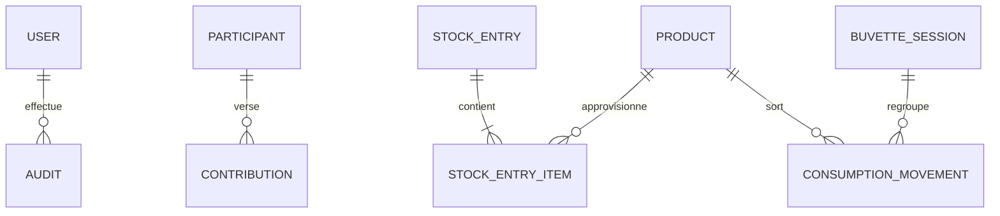

# Schéma Redis v1

Une application = un préfixe = une équipe. Exemple : `buvette:registre`.

| Clé                                    | Type        | Contenu                                        | Expiration |
| -------------------------------------- | ----------- | ---------------------------------------------- | ---------- |
| `<prefix>:registre`                    | String JSON | Registre métier complet, utilisateurs et audit | Aucune     |
| `<prefix>:session:<sha256(token)>`     | String      | ID utilisateur                                 | 7 jours    |
| `<prefix>:login:<sha256(identifiant)>` | Integer     | Nombre de tentatives                           | 15 minutes |

```typescript
{
  schemaVersion: 1,
  revision: 0,       // CAS Redis, incrément après chaque commande
  nextSequence: 1,   // ordre strict des mouvements de stock
  users: [],
  participants: [],
  contributions: [],
  products: [],
  entries: [],       // chaque entrée embarque ses items
  events: [],        // chaque soirée embarque ses lignes de sortie
  audit: []          // états avant/après, auteur, date et références filtrables
}
```

Les définitions exactes se trouvent dans `src/lib/types.ts`. Les contraintes de saisie sont définies par `commandSchema` dans `src/lib/domain.ts`. Les collections appartiennent au même document et sont validées puis écrites atomiquement ; les références ne reposent pas sur des transactions multiclés.



Les IDs sont des UUID. Les dates techniques sont ISO 8601 UTC et les dates métier `YYYY-MM-DD`. L’interface affiche les dates techniques dans le fuseau Europe/Paris.

Une entrée porte une séquence et plusieurs items (produit, quantité, prix réel). Chaque ligne de sortie porte une séquence indépendante. Une soirée clôturée porte une séquence de clôture, postérieure à toutes ses sorties initiales. Les corrections préservent les séquences. Les retours sont affectés à la séquence de clôture ; ils ne deviennent disponibles qu’à ce moment dans le registre reconstruit.

Les allocations FIFO et leurs valeurs sont reconstruites. Aucun champ `stock`, `quantityConsumed`, `unitPrice` moyen de sortie ni total financier redondant n’est persisté. Pour une soirée ouverte, la consommation est indéterminée et affichée « — ». Pour une soirée clôturée, la quantité consommée est la différence sortie/retour ; la valeur provient des lots alloués.

La commande de mutation est rejouée en cas de conflit de révision. Le script compare la révision du document courant avant le remplacement. Un conflit ne peut pas valider une ancienne vérification de stock.

La migration initiale valide la version 1 sans changer les données. Toute évolution devra ajouter une transformation explicite depuis la version précédente et utiliser la même comparaison atomique de révision. Le seed crée le registre avec `SET NX` ; il est sans effet destructif sur une base existante.
